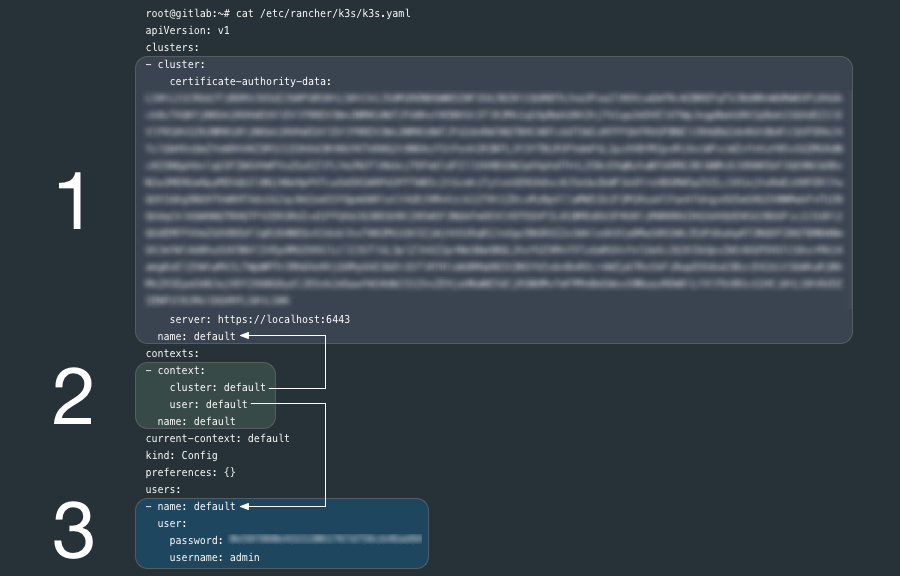
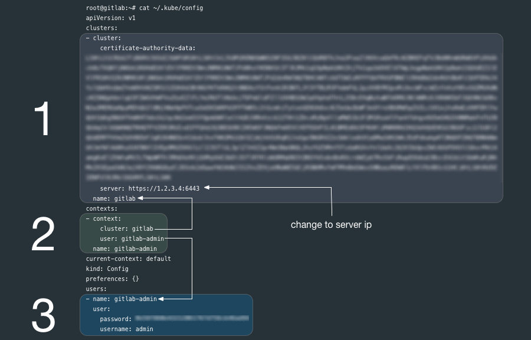

# k3s + Gitlab

**Work in progress.**

Utilizing [k3s] to manage a self-hosted [Gitlab] instance is for individuals and organizations already leveraging [Kubernetes] for platform development. Many applications such as [Gitlab] do not need sophisticated compute clusters to operate, yet [k3s] allows us to achieve continuity in the management of all development operations. [k3s], although slim-down, is a fully functional [Kubernetes]. Containers have made applications like [Gitlab] incredibly portable, [Kubernetes] brings that portability to container management and [k3s] makes that portability available at the smallest of scale.

This document outlines a process for setting up a Gitlab instance in a single custom node Kubernetes ([k3s]) cluster on [Vultr].  However, there is very little difference in utilizing other vendors, such as [Digital Ocean] or [Linode].

**Disclosure**: Links to [Vultr], [Digital Ocean] and [Linode] are affiliate links and credit my accounts on those services if you sign up. Affiliate credit helps me offset the expense of setting up environments for developing articles and tutorials. I do not endorse any of these vendors specifically; however, they are all great choices if you are looking for alternatives or redundancies to Google, Amazon, or Microsoft. [Kubernetes] is a Cloud Native and Vendor Neutral solution, and if implemented well, the specific vendor should only be a high-level business concern. 

## Obtain a Server (or VM Instance)

This document utilizes one **Los Angeles** instance of a **2 CPU / 4096MB Memory** **[Ubuntu 18.04] x64** server on [Vultr] with Private Networking enabled and a "Server Hostname & Label" of **gitlab.apk8s.dev**. At the time of this writing, the instance cost is $20/mo, or 3 cents per hour.

## Configure DNS

Add DNS `A` records for your domain, such as: **gitlab.apk8s.dev** and ***.gitlab.apk8s.dev**, pointed to the public IP address of the [Vultr] instance above. See your Domain Name / DNS provider for instructions on adding `A` records.

## Prepare Server

Login to the new server (IP) as the root user.

```bash
ssh root@NEW_SERVER_IP
```

Upgrade any outdated packages:

```bash
apt update && apt upgrade -y
```

## Install [k3s]

[k3s] is "Easy to install. A binary of less than 40 MB. Only 512 MB of RAM required to run." this allows us to utilized Kubernetes for managing the Gitlab application container on a single node while limited the footprint of Kubernetes itself. 

```bash
curl -sfL https://get.k3s.io | sh -
```

[k3s] is now installed and the [Kubernetes] API is listening on the public IP of the server through port **6443**. 

## Remote Access with `kubectl`

From your local workstation you should be able to issue a [curl] command to Kubernetes:

```bash
curl --insecure https://SERVER_IP:6443/
```

The new [k3s] cluster should return a **401 Unauthorized** response with the following payload:

```json
{
  "kind": "Status",
  "apiVersion": "v1",
  "metadata": {

  },
  "status": "Failure",
  "message": "Unauthorized",
  "reason": "Unauthorized",
  "code": 401
}
```

[k3s] credentials are stored on the server at `/etc/rancher/k3s/k3s.yaml`:

Review the contents of the generated `k8s.yml` file:

```bash
cat /etc/rancher/k3s/k3s.yaml
```

The `k3s.yaml` is a Kubernetes config file used by `kubectl` and contains (1) one cluster, (3) one user and a (2) context that ties them together. `kubectl` uses [contexts] to determine the cluster you wish to connect to and use for access credentials. The `current-context` section is the name of the context currently selected with the `kubectl config use-context` command.




Ensure that [kubectl] is installed on your local workstation.

If you have [kubectl] installed on your local workstation, notice that the `k8s.yml` file on the new [k3s] node is a `kubectl` config file similar to the file `~/.kube/config` generated by `kubectl`.  

You can copy the entire `k8s.yml` file over to `~/.kube/config` if you have not other contexts there already, it may also be a good practice to rename the **cluster**, **user** and **context** from `default` to something more descriptive. 

If you already have clusters, user and contexts in your `~/.kube/config` you can add these new entries after renaming them. 

Another option is to create another file such as `~/.kube/gitlab-config` and set the **KUBECONFIG** environment variable to point to it. Read more about `kubectl` [configuration options][contexts].



Before you being configuring [k3s] make sure `kubectl` pointed to the correct cluster: 

```bash
kubectl config use-context gitlab-admin
```

Ensure that you are able to communicate with the new [k3s] cluster by requesting a list of nodes:

```bash
kubectl get nodes
```

If successful you should get output similar to the following:

```bash
NAME               STATUS   ROLES    AGE    VERSION
gitlab.apk8s.dev   Ready    <none>   171m   v1.14.1-k3s.4
```

## Install Cert Manager / [Let's Encrypt]

[Gitlab] ships with [Let's Encrypt] capabilities, however since we are running Gitlab through [k3s] (Kubernetes) Ingress (using [Traefik],) we need to generate Certs and provide TLS from the cluster. 

Create Cert Manager's Custom Resource Definitions: 
```bash
kubectl apply -f https://raw.githubusercontent.com/jetstack/cert-manager/release-0.8/deploy/manifests/00-crds.yaml
```

Install [Cert Manager] with the [./k8s/0000-global/001-cert-manager-helm.yml] manifest (the [k3s] way):

```bash
kubectl create -f ./k8s/0000-global/001-cert-manager-helm.yml 
```

Ensure that cert manager is now running:
```bash
kubectl get all -n cert-manager
```

Output:
```plain
NAME                                          READY   STATUS    RESTARTS   AGE
pod/cert-manager-5d669ffbd8-2s6pm             1/1     Running   0          5m11s
pod/cert-manager-cainjector-79b7fc64f-n9qdt   1/1     Running   0          5m11s
pod/cert-manager-webhook-6484955794-j6cpr     1/1     Running   0          5m11s

NAME                           TYPE        CLUSTER-IP     EXTERNAL-IP   PORT(S)   AGE
service/cert-manager-webhook   ClusterIP   10.43.103.18   <none>        443/TCP   5m11s

NAME                                      READY   UP-TO-DATE   AVAILABLE   AGE
deployment.apps/cert-manager              1/1     1            1           5m11s
deployment.apps/cert-manager-cainjector   1/1     1            1           5m11s
deployment.apps/cert-manager-webhook      1/1     1            1           5m11s

NAME                                                DESIRED   CURRENT   READY   AGE
replicaset.apps/cert-manager-5d669ffbd8             1         1         1       5m11s
replicaset.apps/cert-manager-cainjector-79b7fc64f   1         1         1       5m11s
replicaset.apps/cert-manager-webhook-6484955794     1         1         1       5m11s
```


Add a [ClusterIssuer] to handle the generation of Certs cluster-wide:

***NOTE:** First edit `./k8s/0000-global/005-clusterissuer.yml` and replace **YOUR_EMAIL_ADDRESS** with your email address.

```bash
kubectl apply -f ./k8s/0000-global/005-clusterissuer.yml 
```

## Install Gitlab

Create the namespace `gitlab`:

```bash
kubectl apply -f ./k8s/1000-gitlab/0000-global/000-namespace.yml
```

Generate a TLS Certificate (first edit [./k8s/1000-gitlab/0000-global/010-certs.yml](./k8s/1000-gitlab/0000-global/010-certs.yml) and replace **apk8s.dev** with your domain):

```bash
kubectl apply -f ./k8s/1000-gitlab/0000-global/010-certs.yml
```


[Let's Encrypt]: https://letsencrypt.org/
[ClusterIssuer]: https://docs.cert-manager.io/en/latest/tasks/issuers/
[Traefik]:https://traefik.io/
[Cert Manager]: 
[./k8s/0000-global/001-cert-manager-helm.yml]:./k8s/0000-global/001-cert-manager-helm.yml
[contexts]: https://kubernetes.io/docs/tasks/access-application-cluster/configure-access-multiple-clusters/
[kubectl]: https://kubernetes.io/docs/tasks/tools/install-kubectl/
[k3s]: https://k3s.io/
[Vultr]: https://www.vultr.com/?ref=7418713
[Gitlab]: https://about.gitlab.com/
[Digital Ocean]: https://m.do.co/c/97b733e7eba4
[Linode]: https://www.linode.com/?r=848a6b0b21dc8edd33124f05ec8f99207ccddfde
[Kubernetes]: https://kubernetes.io/
[Ubuntu 18.04]: http://releases.ubuntu.com/18.04/